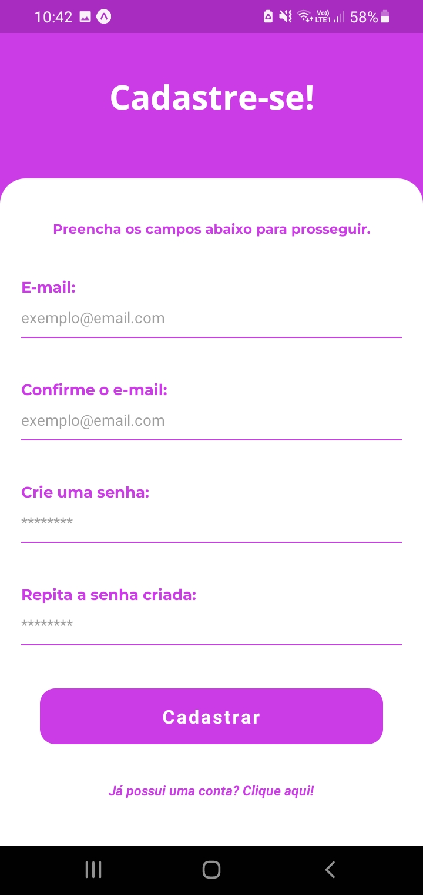
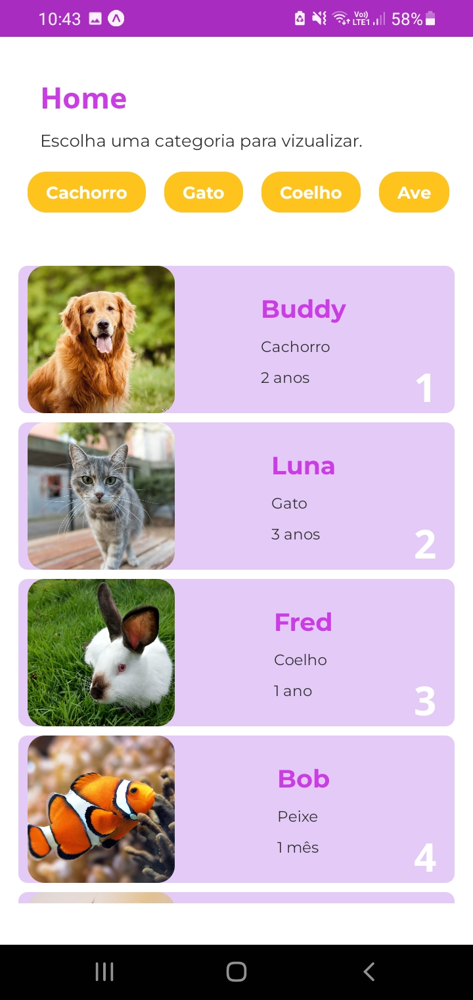
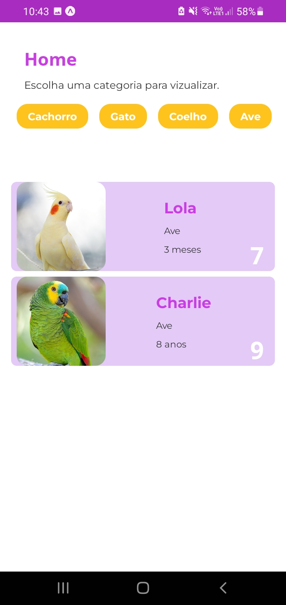
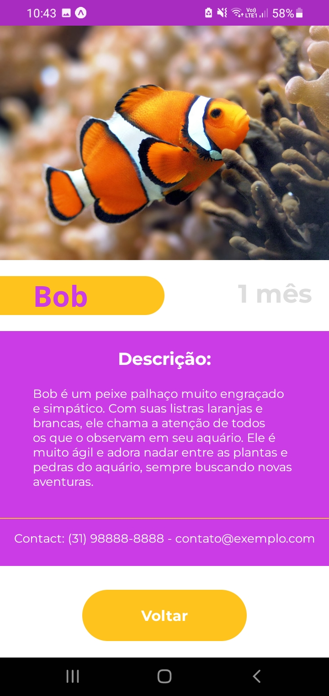

<h1 align="center">PalmPet</h1>

Um aplicativo de adoção de animais em React Native.</h1>

## Sobre

Um aplicativo simples de adoção de animais desenvolvido para celulares utilizando Javascript como linguagem principal de desenvolvimento e a biblioteca React Native. O software em questão é, na verdade, um teste passado pela empresa PalmSoft, em que o objetivo é desenvolver uma aplicação mobile que possua uma tela de login, uma página principal (Home Page) e uma tela de detalhamento do item selecionado.

Para o desenvolvimento foram utilizadas as seguintes tecnologias:

- Javascript
- React Native
- Node.js (v19.8.1)
- Npm/Npx (v8.19.2)
- Expo (v6.3.2)

**Observação:** a IDE utilizada para a contrução do projeto foi o Visual Studio Code e o sistema operacional utilizado foi o Arch Linux.

**Plataforma de teste**: Celular físico via Expo Go (QR Code).

É importante citar também que o modelo de celular utilizado para os testes foi o Galaxy A10s, que possui uma tela de 6,2 polegadas.

## Características

No projeto estão presentes as seguintes telas disponíveis para o usuário:

### 1. Tela de boas vindas.

Uma página simples para dar as boas vindas ao usuário. A página contém o logo do aplicativo e um botão para a progressão para a próxima tela. Além disso, tanto a logo quanto o container contendo os textos/instruções possuem animações quando a página é inicializada.

Imagem:

### 2. Tela de login.

A página de login possui dois campos: o de e-mail e o de senha. Para poder entrar e avançar, o usuário deve ter uma conta cadastrada. Caso não possua uma conta registrada, é possível clicar no link "Cadastre-se aqui" para ser redirecionado para a página de cadastro.

**Observação**: É possível pular a etapa de cadastro utilizando o login de administrador, que foi criado para facilitar e agilizar os testes. Para isso, deve-se preencher os campos com os dados presentes no arquivo admin.js.

Imagem:

### 3. Tela de cadastro.

Na página de cadastro é efetuada a criação de uma conta para poder avançar na tela de login posteiormente. Aqui são realizadas diversas validações para identificar se o usuário preencheu os campos corretamente. Após o cadastro o usuário é redirecionado para a tela de login.

**Observação:** A conta criada não é armazenada por nenhum tipo de banco de dados, ou seja, ela é válida apenas para a sessao atual. Caso a aplicação seja reiniciada, os dados da conta serão perdidos.

Imagem:

### 4. Tela principal

Também chamada de Home Page, essa é a tela principal da aplicação em que o usuário tem acesso ao conteúdo. No caso, a página é composta por uma lista de animais e de categorias para os mesmos. Ao selecionar uma categoria específica, serão exibidos apenas os animais que estão listados nela. Ao clicar em algum animal, o usuário é levado para a próxima página.

Imagem:

    
    

### 5. Tela de detalhamento

Uma tela simples, porém elegante, que expande a imagem do animal e mostra dados adicionais como idade, nome, contato e descrição.

Imagem:

## Registro de atividades

Listadas abaixo todas as anotações de atividades registradas:

1. Criada a pasta do projeto utilizando o Expo.

2. Importada a biblioteca "@react-navigation". Também foi importado o recurso "native-stack" da biblioteca em questão.

3. Criada uma pasta "views" dentro de "assets" e, nessa pasta, foi criada um outra pasta chamada "Welcome" contendo um arquivo chamado "index.js" que irá conter o conteúdo da página.

4. Adicionada uma pasta "routes" dentro de "assets", contendo um arquivo "index.js" para administrar as rotas.

5. Criada a lógica para o fluxo de rotas em "routes/index.js".

6. Feita a importação do arquivo de rotas no arquivo principal ("App.js"), bem como sua chamada na estrutura React.

7. Criação do arquivo README do projeto para documentar futuramente, bem como a adição deste documento ("devlog.md") para a constante anotação das mudanças no projeto.

8. Criada uma pasta "img" para armazenar todas as imagens utilizadas no projeto. Efetuada a mudança de caminho das imagens já existentes, inclusive no arquivo "app.json".

9. Instalada a biblioteca "react-native-animatable".

10. Desenvolvida a estrutura da página de "Welcome".

11. Adicionada a pasta "styles" dentro de "assets" para guardar a estilização das páginas.

12. Criada a estilização da página de "Welcome".

13. Criada a pasta "LogIn" em "views".

14. Adicionado o ícone passado no e-mail do teste no projeto.

15. Importada a fonte Monserrat do Google Fonts.

16. Adicionadas as bibliotecas "react-native-gesture-handler", "expo-font" e "expo-app-loading".

17. Lógica de carregamento e validação de fontes refatorada.

18. Importada a fonte Open Sans do Google Fonts.

19. Criada a estrutura da tela de login.

20. Criada a estilização da tela de login.

21. Criada a pasta "SignUp" dentro de "Views".

22. Adicionado um arquivo index.js na pasta "SignUp".

23. Adicionada a rota para SignUp.

24. Feita a estruturação da página de cadastro.

25. Implementada a estilização da página de cadastro.

26. Criada uma lógica simples para leitura e validação dos inputs na tela de cadastro.

27. Criados alertas para os casos de dados inválidos ou sucesso na criação de uma conta.

28. Modularização das funções handleRegister e defaultInput na tela de cadastro.

29. Substituídos os arquivos PNG favicon, adaptive-icon, icon e splash por novos PNGs com os mesmos nomes.

30. Terminada a lógica para validação de login a partir de uma conta cadastrada.

31. Criado um arquivo admin.js dentro da pasta "views/LogIn" contendo os dados de uma conta pré-registrada (para facilitar os testes)

32. Adicionada a lógica para a validação de login pelo admin.

33. Função de validação de login modularizada para o arquivo handleLogin.js.

34. Validação de admin modularizada para adminVal.js.

35. Iniciado o desenvolvimento da tela de Home Page.

36. Adicionado um arquivo de estilização para a tela de Home.

37. Criados dois arquivos .json para simular um banco de dados/API.

38. Adicionados alguns ícones placeholders para a propriedade "img" das categorias.

39. Corrigido o problema da rota Details.

40. Criada a página Details.

41. Estilização de Details adicionada na pasta styles.

42. Mudança na lógica da página Home para que os filtros funcionassem corretamente.

## Fontes de pesquisa

- [ChatGPT](https://openai.com/blog/chatgpt)
- [Documentação do Expo](https://docs.expo.dev/)
- [Documentação do Javascript](https://developer.mozilla.org/pt-BR/docs/Web/JavaScript)
- [Documentação do React Native]( https://reactnative.dev/docs/getting-started)
- [Youtube](https://www.youtube.com/)

## Considerações finais

O projeto teve início no dia 27/3/2023 e foi finalizado no dia 04/3/2023, completando uma semana de desenvolvimento e atendendendo a tudo que foi solicitado com excessão do uso do endpoint referido, pois o mesmo estava retornando **"not found"**. Para contornar isso, foram criados arquivos ".json" para armazenarem os dados dos animais e das categorias, simulando, de certa forma, uma API.

Uma boa experiência é o pensamento que se tira desse projeto, pois é mais um recurso novo (React Native) que teve que ser aprendido e estudado para que fosse possível dar continuidade no desenvolvimento do software.